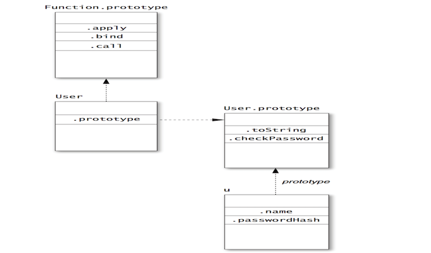

# Effective Javascript

---

### Introduction
+++
The book


+++

# Javascript @ Yamsafer

More than half the developers @ Yamsafer use Javascript.
- Frontenders (6 developers)
- Backenders (5 developers)
- QA Team (5 developers)

---

### Item 3: Beware of Implicit Coercions

+++
- Javascript is dynamically typed languages
- JavaScript can be surprisingly forgiving when it comes to type errors.
```
3 + true; // 4
```
- JavaScript *coerces* a value to the expected type by following various automatic conversion protocols

```
2 + 3; // 5
"hello" + " world"; // "hello world"
```
_But what happens when_
```
"2" + 3; // "23" 
2 + "3"; // "23"
```
+++

*** _Order has effect_
```
1 + 2 + "3"; // "33"
(1 + 2) + "3"; // "33"
1 + "2" + 3; // "123"
(1 + "2") + 3; // "123"
```
- coercions can also hide errors
```
1 + null // 1
1+ undefined // NaN
```
+++
#### Testing for `NaN`
- `isNaN` not reliable
```
isNaN("foo");
isNaN(undefined);
isNaN({});
isNaN({ valueOf: "foo" }); // true
```
- Reliable check (`NaN` Unique to itself)
```
var a = NaN;
a !== a; // true var b = "foo";
b !== b; // false
```
+++
#### Objects can also be coerced to primitives.
- To strings using `toString` method
```
"the Math object: " + Math; // "the Math object: [object Math]" 
"the JSON object: " + JSON; // "the JSON object: [object JSON]"
```
Objects can be converted to numbers via their `valueOf` method.
```
"J" + { toString: function() { return "S"; } }; // "JS"
"JS" 2 * { valueOf: function() { return 3; } }; // 6
```

+++
### What happens when we run this
```
var obj = {
    toString: function () {
        return "[object MyObject]";
    },
    valueOf: function () {
        return 17;
    }
};
"object: " + obj; // ???
```
+++

### Answer

`// "object: 17"`

+++

### Truthiness coercion

- `if`, `||`, and `&&` logically work with boolean values
- *falsy* values: `false`, `0`, `-0`, `""`, `NaN`, `null`, and `undefined`.
- It is not always safe to use truthiness to check whether a function argument or object property is defined.
```
function point(x, y) {
    if (typeof x === "undefined") {
        x = 320;
    }
    if (typeof y === "undefined") {
        y = 240;
    }
    return { x: x, y: y };
}
```
---

### Item 5: Avoid using == with Mixed Types

+++

What happens when we run this

```
"1.0e0" == { valueOf: function() { return true; } };
// true
```

+++
Be explicit and use `===`
```
var today = new Date();
if (form.month.value == (today.getMonth() + 1) && form.day.value == today.getDate()) {
    // happy birthday!
    // ...
}
```

```
var today = new Date();
if (+form.month.value === (today.getMonth() + 1) && // strict 
    +form.day.value === today.getDate()) { // strict 
        // happy birthday!
        // ...
}
```
+++
- When the two arguments are of the same type, there’s no difference in behavior between `==` and `===.`
- using strict equality is a good way to make it clear to readers that there is no conversion involved in the comparison

+++

#### Coercion rules


---

### Item 9: Always Declare Local Variables

+++

- JavaScript’s variable assignment rules make it all too easy to create global variables accidentally.

```
function swap(a, i, j) { 
    temp = a[i]; // global 
    a[i] = a[j];
    a[j] = temp;
}
```
<span style="font-size:1.8rem;">
    Purposefully creating global variables is bad style, but accidentally creating global variables can be a downright disaster.
<span/>


---

### Item 11: Get Comfortable with Closures

Functions that keep track of variables from their containing scopes are known as closures.

+++

#### Understanding closures only requires learning three essential facts.

- JavaScript allows you to refer to variables that were defined outside of the current function

```
function makeSandwich() {
    var magicIngredient = "peanut butter"; 
    function make(filling) {
        return magicIngredient + " and " + filling;
    }
    return make("jelly");
}
makeSandwich(); // "peanut butter and jelly"
```

+++

- Functions can refer to variables defined in outer functions even after those outer functions have returned.

```
function sandwichMaker() {
    var magicIngredient = "peanut butter"; 
    function make(filling) {
        return magicIngredient + " and " + filling;
    }
    return make;
}
var f = sandwichMaker();
f("jelly"); // "peanut butter and jelly"
f("bananas"); // "peanut butter and bananas" 
f("marshmallows"); // "peanut butter and marshmallows"
```

<span style="font-size:1.8rem;">
They also internally store any variables they may refer to that are defined in their enclosing scopes.
</span>
+++

- They can update the values of outer variables.

```
function box() {
    var val = undefined; 
    return {
        set: function (newVal) { val = newVal; }, 
        get: function () { return val; },
        type: function () { return typeof val; }
    };
}
var b = box();
b.type(); // "undefined" 
b.set(98.6);
b.get(); // 98.6 
b.type(); // "number"
```
<span style="font-size:1.8rem;">
Closures actually store references to their outer variables, rather than copying their values.
</span>
---

### Item 12: Understand Variable Hoisting

+++

- A reference to a variable `foo` is bound to the nearest scope.
- JavaScript does not support block scoping
- Variable definitions are scoped to their nearest enclosing function.

+++

```
function isWinner(player, others) {
    var highest = 0;
    for (var i = 0, n = others.length; i < n; i++) {
        var player = others[i];
        if (player.score > highest) {
            highest = player.score;
        }
    }
    return player.score > highest;
}
```

<span style="font-size:1.8rem;">
the inner declaration of player simply redeclares a variable that was already in scope
</span>
+++

##### Understanding JavaScript variable declarations

1. A declaration: 
<br/>
    JavaScript implicitly “hoists” the declaration part to the top of the enclosing function
2. An assignment:
<br/>
    Leaves the assignment in place.

+++

```
function trimSections(header, body, footer) {
    for (var i = 0, n = header.length; i < n; i++) {
        header[i] = header[i].trim();
    }
    for (var i = 0, n = body.length; i < n; i++) {
    body[i] = body[i].trim();
    }
    for (var i = 0, n = footer.length; i < n; i++) {
        footer[i] = footer[i].trim();
    }
}
```
_The trimSections function appears to declare six local variables (three called i and three called n), but hoisting results in only two_


---

### Item 13: Use Immediately Invoked Function Expressions to Create Local Scopes

+++
What does this (buggy!) program compute?
```
function wrapElements(a) {
    var result = [], i, n;
    for (i = 0, n = a.length; i < n; i++) {
        result[i] = function () { return a[i]; };
    }
    return result;
}
var wrapped = wrapElements([10, 20, 30, 40, 50]);
var f = wrapped[0];
f(); // ?
```

+++

The programmer may have intended for it to produce 10, but it actually produces the undefined value.

_Closures store their outer variables by reference, not by value._


+++IIFE

```
function wrapElements(a) {
    var result = [];
    for (var i = 0, n = a.length; i < n; i++) {
        (function () {
            var j = i;
            result[i] = function () { return a[j]; };
        })();
    }
    return result;
}
var f = wrapped[0];
f(); // 10
```
_used an IIFE to create a local scope_

---

### Item 18: Function, Method, and Constructor Calls

+++

##### Function

```
function hello(username) {
    return "hello, " + username;
}
hello("Keyser Söze"); // "hello, Keyser Söze"

```

+++

##### Methods

Object properties that happen to be functions


```
var obj = {
    hello: function () {
        return "hello, " + this.username;
    },
    username: "Hans Gruber"
};
obj.hello(); // "hello, Hans Gruber"
```

_Calling a method on an object looks up the method and then uses the object as the method’s receiver._

+++

##### Constructors

```
function User(name, passwordHash) { 
    this.name = name; 
    this.passwordHash = passwordHash;
}

var u = new User("sfalken", "0ef33ae791068ec64b502d6cb0191387");
u.name; // "sfalken"
```

---

### Item 19: Get Comfortable Using Higher-Order Functions

+++

Higher-order functions are nothing more than functions that take other functions as arguments or return functions as their result.

```
var names = ["Fred", "Wilma", "Pebbles"]; 
var upper = names.map(function(name) {
    return name.toUpperCase(); 
});
upper; // ["FRED", "WILMA", "PEBBLES"]
```

+++

What's in commin

```
var random = "";
for (var i = 0; i < 8; i++) {
    random += String.fromCharCode(Math.floor(Math.random() * 26)+ aIndex); 
}
random; // "bdwvfrtp" (different result each time)
```

```
var digits = "";
for (var i = 0; i < 10; i++) {
    digits += i; 
}
digits// "0123456789"
```
```
var aIndex = "a".charCodeAt(0); // 97
var alphabet = "";
for (var i = 0; i < 26; i++) {
    alphabet += String.fromCharCode(aIndex + i);
}
```
all have loops and concatinating some result of a logic

+++

Abstraction

```
function buildString(n, callback) { 
    var result = "";
    for (var i = 0; i < n; i++) {
        result += callback(i);
    }
    return result; 
}
```
Result
```
var alphabet = buildString(26, function(i) { 
    return String.fromCharCode(aIndex + i);
});
alphabet; // "abcdefghijklmnopqrstuvwxyz"
```

---

### Item 25: Use bind to Extract Methods with a Fixed Receiver

+++

- A function’s receiver is determined by how it is called
```
var buffer = {
    entries: [],
    add: function (s) {
        this.entries.push(s);
    },
    concat: function () {
        return this.entries.join("");
    }
};
var source = ["867", "-", "5309"];
source.forEach(buffer.add); // error: entries is undefined
```

<span style="font-size:1.8rem">
forEach uses the global object as the default receiver.
</span>
+++
##### Solution
```
var source = ["867", "-", "5309"]; source.forEach(function(s) {
    buffer.add(s);
});
buffer.join(); // "867-5309"
```
This version creates a wrapper function that explicitly calls `add` as a method of `buffer`.

+++

#### `bind`

Function objects come with a bind method that takes a receiver object and produces a wrapper function that calls the original function as a method of the receiver.

```
var source = ["867", "-", "5309"]; 
source.forEach(buffer.add.bind(buffer)); 
buffer.join(); // "867-5309"
```
<span style="font-size:1.8rem">
Keep in mind that buffer.add.bind(buffer) creates a new function rather than modifying the buffer.add function.
</span>
---

### Item 26: Use bind to Curry Functions

+++

The bind method of functions is useful for more than just binding methods to receivers.

```
function simpleURL(protocol, domain, path) {
    return protocol + "://" + domain + "/" + path;
}
```
```
var urls = paths.map(function (path) {
    return simpleURL("http", siteDomain, path);
});
```

```
var urls = paths.map(simpleURL.bind(null, "http", siteDomain));
```

<span style="font-size:1.8rem">
when the result of `simpleURL.bind` is called with a single argument path, the function delegates to `simpleURL("http", siteDomain, path)`.
</span>
---

### Item 30: Prototype

+++

```
function User(name, passwordHash) {
    this.name = name; 
    this.passwordHash = passwordHash;
}
User.prototype.toString = function () {
    return "[User " + this.name + "]";
};
User.prototype.checkPassword = function (password) {
    return hash(password) === this.passwordHash;
};
var u = new User("sfalken",
    "0ef33ae791068ec64b502d6cb0191387");
```

+++



+++

##### Lookup

- Property lookups start by searching the object’s own properties; for example, u.name and u.passwordHash return the current values of immediate properties of u. 
- Properties not found directly on u are looked up in u’s prototype. Accessing u.checkPassword, for example, retrieves a method stored in User.prototype.

_Classes in JavaScript are essentially the combination of a constructor function (User) and a prototype object used to share methods between instances of the class (User.prototype)._


---

Item 34: Store Methods on Prototypes

+++

Maybe you are thinking why to use prototype? just do something like this:

```
function User(name, passwordHash) {
this.name = name; 
this.passwordHash = passwordHash; 
this.toString = function () {
    return "[User " + this.name + "]";
};
    this.checkPassword = function (password) {
        return hash(password) === this.passwordHash;
    };
}
```

+++


+++


---

### Item 35: Use Closures to Store Private Data

+++

- JavaScript’s object system does not particularly encourage or enforce information hiding.
- JavaScript does provide one very reliable mecha- nism for information hiding: the closure.


```
function User(name, passwordHash) {
    this.toString = function () {
        return "[User " + name + "]";
    };
    this.checkPassword = function (password) {
        return hash(password) === passwordHash;
    };
}

```

---

### Item 43: Build Lightweight Dictionaries from Direct Instances of Object
+++

- JavaScript object is a table mapping string property names to values.
- This makes objects pleasantly lightweight for imple- menting dictionaries
- JavaScript provides a convenient construct for enumerating the property names of an object, the for...in loop

```
var dict = { alice: 34, bob: 24, chris: 62 }; 
var people = [];
for (var name in dict) {
    people.push(name + ": " + dict[name]);
}
people; // ["alice: 34", "bob: 24", "chris: 62"]
```

+++
- Object also inherits properties from its prototype object
- Properties on a prototype object can cause unexpected properties to appear when enumerating dictionary entries. (`prototype pollution`)

```
var dict = new Array();
dict.alice = 34;
dict.bob = 24;
dict.chris = 62;
dict.bob; // 24
Array.prototype.first = function() { 
    return this[0];
};
Array.prototype.last = function() { 
    return this[this.length – 1];
};
var names = [];
for (var name in dict) { 
    names.push(name);
}
names; // ["alice", "bob", "chris", "first", "last"]
```

+++

##### Rule of using objects as lightweight dictionaries

Only use direct instances of `Object` as `dictionaries`

```
var dict = {};
dict.alice = 34;
dict.bob = 24;
dict.chris = 62;
var names = [];
for (var name in dict) { 
    names.push(name);
}
names; // ["alice", "bob", "chris"]
```
---
### Item 44: Use null Prototypes to Prevent Prototype Pollution

+++

Solution for `prototype pollution` is create a new object with an empty prototype but how?


```
function C() { } 
C.prototype = null;
var o = new C();
Object.getPrototypeOf(o) === null; // false 
Object.getPrototypeOf(o) === Object.prototype; // true
```

+++

ES5 offers the first standard way to create an object with no prototype. The `Object.create` function.

```
var x = Object.create(null); 
Object.getPrototypeOf(o) === null; // true
```

+++
<span style="font-size:1.8rem;">
The `Object.keys()` method returns an array of a given object's own enumerable properties, in the same order as that provided by a `for...in` loop (the difference being that a for-in loop enumerates properties in the prototype chain as well.
</span>
<span style="font-size:1.8rem;">
Add methods as non enumerable
</span>
```
Object.defineProperty(Object.prototype, "allKeys", {
    value: function () {
        var result = [];
        for (var key in this) {
            result.push(key);
        }
        return result;
    },
    writable: true,
    enumerable: false,
    configurable: true
});
```

---

### Item 54: Treat undefined As “No Value”


+++

Function parameters that are not provided with actual arguments have the value undefined

```
function f(x) { 
    return x;
}
f(); // undefined
```

- Treating undefined as the absence of any specific value is a convention established by the language.
- Using it for other purposes is a risky proposition.


+++

##### Optional arguments

```
function Server(port, hostname) { 
    if (hostname === undefined) {
        hostname = "localhost";
    }
    hostname = String(hostname);
}

var s1 = new Server(80, "example.com");
var s2 = new Server(80); // defaults to "localhost"
```
Alternative

```
function Server(port, hostname) {
    hostname = String(hostname || "localhost");
}
```
<span style="font-size:1.8rem;">
This version uses the logical `OR` operator `(||)`, which returns the first argument if it is a truthy value and otherwise returns its second argument.
</span>
+++

##### Truthiness is not always a safe test

- If a function should accept the empty string as a legal value, a truthy test will override the empty string and replace it with the default value.
- Similarly, a function that accepts a number should not use a truthy test if it allows 0 (or NaN, although it’s less common) as an acceptable value.

```
function Element(width, height) {
    this.width = width || 320; // wrong test 
    this.height = height || 240; // wrong test 
}
var c1 = new Element(0, 0);
c1.width; // 320 
c1.height; // 240
```

---

### Item 56: Avoid Unnecessary State

+++

- APIs are sometimes classified as either stateful or stateless.
- A stateless API provides functions or methods whose behavior depends only on their inputs, not on the changing state of the program.
- Stateless APIs tend to be easier to learn and use, more self-documenting, and less error-prone.

+++

- Another benefit of stateless APIs is conciseness

```
[Host]
address=172.0.0.1
name=localhost
[Connections]
timeout=10000
```

```
var ini = INI.parse(src);
ini.setSection("Host");
var addr = ini.get("address"); 
var hostname = ini.get("name");
ini.setSection("Connection");
var timeout = ini.get("timeout");
var server = new Server(addr, hostname, timeout);
````

```
var ini = INI.parse(src);
var server = new Server(ini.Host.address,
                        ini.Host.name,
                        ini.Connection.timeout);
```

---

### Item 61: Don’t Block the Event Queue on I/O

+++

- JavaScript programs are structured around `events`
- `synchronous`, or `blocking` functions stops the program from doing any work while it waits for its input.

```
var text = downloadSync("http://example.com/file.txt"); console.log(text);
```
- In JavaScript, most I/O operations are provided through asynchronous, or nonblocking APIs.

```
downloadAsync("http://example.com/file.txt", function(text) { 
    console.log(text);
});
```

+++

- API initiates the download process and then immediately returns after storing the callback in an internal registry.

- When download completes the system calls the registered callback.

- The system does not just jump right in and call the callback the instant the download completes

- JavaScript is sometimes described as providing a run-to-completion guarantee.

+++


+++

- Benefit of the run-to-completion is that you have complete control over the application state.

- Drawback of run-to-completion is that any and all code you write effectively holds up the rest of the application from proceeding.

- Be aware of blocking I/O and try to avoid them.


---

### Item 64: Use Recursion for Asynchronous Loops

+++

##### will this work?

```
function downloadOneAsync(urls, onsuccess, onerror) {
    for (var i = 0, n = urls.length; i < n; i++) {
        downloadAsync(urls[i], onsuccess, function (error) { // ?
        });
        // loop continues
    }
    throw new Error("all downloads failed");
}
```
<span style="font-size:1.8rem;">
So we need to implement something that acts like a loop, but that doesn’t continue executing until we explicitly say so.
</span>
+++

```
function downloadOneAsync(urls, onsuccess, onfailure) {
    var n = urls.length;
    function tryNextURL(i) {
        if (i >= n) {
            onfailure("all downloads failed");
            return;
        }
        downloadAsync(urls[i], onsuccess, function () {
            tryNextURL(i + 1);
        });
    }
    tryNextURL(0);
}
```
<div style="font-size:1.8rem;">
Could a `stack overflow` occure ?
Asynchronous APIs return immediately before their callbacks are invoked.
</div>

---

### Item 65: Don’t Block the Event Queue on Computation

+++
- <span style="font-size:2rem;">
Efficiency is not a concern that’s unique to JavaScript. But event-based programming does impose particular constraints.
</span>

- <div style="font-size:1.8rem;">
So what can you do if your application needs to perform expensive computations?
<br/>
Perhaps the simplest approach is to use a concurrency mechanism like the web client platform’s Worker API.
</div>

+++


```
var ai = new Worker("ai.js");
```
<div style="font-size:2rem;">
This has the effect of spawning a new concurrent thread of execution with its own separate event queue, using the source file ai.js as the worker’s script.
<br/>
Application and worker can communicate with each other by sending messages to each other
</div>

```
var userMove = "some move" ;
ai.postMessage(JSON.stringify({
    userMove: userMove
}));
ai.onmessage = function(event) { 
    executeMove(JSON.parse(event.data).computerMove);
};
```

+++

##### Worker
```
self.onmessage = function (event) {
    // parse the user move
    var userMove = JSON.parse(event.data).userMove;
    // generate the next computer move
    var computerMove = computeNextMove(userMove);
    // format the computer move
    var message = JSON.stringify({
        computerMove: computerMove
    });
    self.postMessage(message);
};
function computeNextMove(userMove) { // ...
}
```

+++

##### Different Approach

- Break up an algorithm into multiple steps

<span style="font-size:2rem">
Network graph
</span>
```
Member.prototype.inNetwork = function (other) {
    var visited = {};
    var worklist = [this];
    while (worklist.length > 0) {
        var member = worklist.pop();
        // ...
        if (member === other) { // found?
            return true;
        }
        // ...
    }
    return false;
};
```

+++

```
Member.prototype.inNetwork = function (other, callback) {
    var visited = {};
    var worklist = [this];
    function next() {
        if (worklist.length === 0) {
            callback(false);
            return;
        }
        var member = worklist.pop();
        // ...
        if (member === other) { // found?
            callback(true);
            return;
        }
        // ...
        setTimeout(next, 0); // schedule the next iteration 
    }
    setTimeout(next, 0); // schedule the first iteration 
};
```
<div style="font-size:1.5rem">
- next(): performing a single iteration of the loop and then scheduling the next iteration
- `setTimeout`: add events to queue.
</div>

---

### Item 66: Use a Counter to Perform Concurrent Operations

+++

- Concurrent logic is subtle and easy to get wrong

```
function downloadAllAsync(urls, onsuccess, onerror) {
    var result = [], length = urls.length;
    if (length === 0) {
        setTimeout(onsuccess.bind(null, result), 0); return;
    }
    urls.forEach(function (url) {
        downloadAsync(url, function (text) {
            if (result) {
                // race condition
                result.push(text);
                if (result.length === urls.length) {
                    onsuccess(result);
                }
            }
        }, function (error) {
            if (result) {
                result = null;
                onerror(error);
            }
        });
    });
}
```

+++
```
var filenames = [
    "huge.txt", // huge file 
    "tiny.txt", // tiny file 
    "medium.txt" // medium-sized file
];
downloadAllAsync(filenames, function (files) {
    console.log("Huge file: " + files[0].length); //tiny 
    console.log("Tiny file: " + files[1].length); //medium
    console.log("Medium file: " + files[2].length); // huge
}, function (error) {
    console.log("Error: " + error);
});
```

+++

```
function downloadAllAsync(urls, onsuccess, onerror) {
    var pending = urls.length;
    var result = [];
    if (pending === 0) {
        setTimeout(onsuccess.bind(null, result), 0); return;
    }
    urls.forEach(function (url, i) {
        downloadAsync(url, function (text) {
            if (result) {
                result[i] = text; // store at fixed index 
                pending--; // register the success 
                if (pending === 0) {
                onsuccess(result);
            }
        }
}, function (error) {
            if (result) {
                result = null;
                onerror(error);
            }
        });
});
}
```